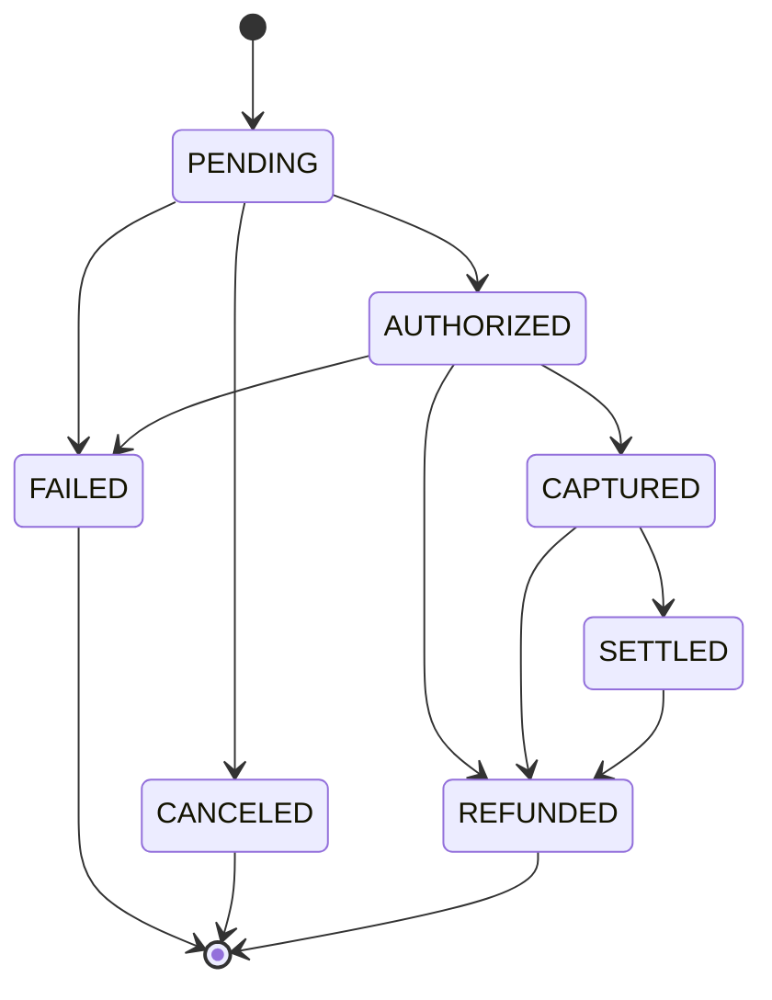

# Payment Processing Idempotency

Sistema de processamento de pagamentos construído em Laravel com foco em um único objetivo: garantir **exactly once financeiro**. Nenhuma cobrança duplicada, mesmo diante de retries do cliente, timeouts de rede ou webhooks duplicados do provedor.

## Visão geral

O núcleo do sistema é a combinação de duas técnicas complementares:

1. Uma **máquina de estados** rígida para o ciclo de vida do pagamento, onde transições inválidas são impossíveis de representar.
2. Uma camada de **idempotência dupla**: entre o cliente e a API, e entre a API e o provedor de pagamento (PSP).

Tudo isso organizado em **arquitetura hexagonal** (ports and adapters), para que o núcleo de negócio nunca dependa do framework, do banco de dados ou de HTTP.

## Arquitetura

O código de domínio vive em `App\Payment`, dividido em três camadas com uma regra de dependência em uma única direção:

```
Infrastructure  →  Application  →  Domain
```

### 1. Domain

Núcleo puro em PHP. Não conhece Eloquent, HTTP, filas ou qualquer classe do Laravel. Contém:

1. `Money`, o value object que representa valores monetários sempre em centavos inteiros.
2. `PaymentStatus`, o enum que modela a máquina de estados e valida transições.
3. `Payment`, a entidade rica cujas transições de estado emitem eventos de domínio.
4. Exceções de domínio e os ports (interfaces) que a camada de fora precisa implementar.

### 2. Application

Orquestra o domínio através dos ports. Recebe DTOs e devolve DTOs ou entidades, nunca um `Request` do Laravel ou um model do Eloquent.

### 3. Infrastructure

Os adapters: models e repositórios Eloquent, o provedor de pagamento (real ou fake), middleware HTTP, controllers e o service provider que liga tudo via injeção de dependência.

## Máquina de estados do pagamento



Toda transição passa por validação explícita. Uma tentativa fora do mapa acima lança `InvalidTransitionException` e o estado permanece inalterado.

## Idempotência dupla

### Cliente para API

O cliente envia um header `Idempotency-Key`. A API calcula o fingerprint SHA-256 do corpo canonicalizado da requisição e tenta um `INSERT` protegido por constraint `UNIQUE` no MySQL, nunca um check seguido de insert. Isso torna o travamento atômico mesmo sob concorrência real.

Comportamento por cenário:

1. Chave nova: a requisição segue normalmente.
2. Chave já em processamento (`LOCKED`): resposta `409`.
3. Chave usada com corpo diferente: resposta `422`.
4. Chave já resolvida (`COMPLETED` ou `FAILED`): a resposta original é reproduzida, sem reprocessar nada.

### API para o provedor (PSP)

Ao chamar o gateway de pagamento, a API gera sua própria chave de idempotência e a envia ao provedor. Um timeout ou uma resposta perdida nunca são interpretados como sucesso ou falha: o pagamento permanece `PENDING` até que a reconciliação confirme o estado real junto ao PSP.

## Stack

1. PHP 8.2, com tipagem estrita em todo o código de domínio.
2. Laravel 10.
3. MySQL, com a constraint `UNIQUE` como mecanismo de trava.
4. Docker Compose: nginx, php fpm, MySQL e Redis.
5. PHPUnit para os testes.

## Como executar

O ambiente inteiro roda em containers, sem exigir PHP instalado localmente.

```bash
# sobe o stack (nginx, php fpm, mysql, redis)
docker compose up -d app

# instala as dependências
docker compose run --rm composer install

# gera a chave da aplicação, se ainda não existir
docker compose run --rm artisan key:generate

# roda as migrations
docker compose run --rm artisan migrate
```

A API fica disponível em `http://localhost:8000`.

## Endpoint

### Criar um pagamento

```bash
curl http://localhost:8000/api/payments \
  --request POST \
  --header "Content-Type: application/json" \
  --header "Idempotency-Key: minhaChaveUnicaDaTentativa" \
  --data '{
    "customer_id": "cus_123",
    "amount_cents": 1500,
    "currency": "BRL"
  }'
```

Resposta em caso de sucesso:

```json
{
  "id": "8f2c...",
  "customer_id": "cus_123",
  "amount_cents": 1500,
  "currency": "BRL",
  "status": "CAPTURED",
  "provider_ref": "fake_psp_...",
  "created_at": "2026-08-14T02:15:08-03:00",
  "updated_at": "2026-08-14T02:15:09-03:00"
}
```

Reenviar a mesma requisição com o mesmo header `Idempotency-Key` devolve exatamente essa mesma resposta, marcada com o header `Idempotent-Replay: true`, sem criar um segundo pagamento.

## Testes

```bash
docker compose run --rm php vendor/bin/phpunit
```

A suíte cobre, entre outras coisas:

1. Todas as transições válidas e inválidas da máquina de estados.
2. O cálculo do fingerprint de idempotência, incluindo canonicalização de corpos com chaves em ordens diferentes.
3. O provedor de pagamento fake, com injeção controlada de timeout, resposta perdida, recusa e cobrança duplicada.
4. Uma prova de concorrência real: quinze requisições HTTP disparadas em paralelo contra o stack completo, com a mesma `Idempotency-Key`, resultando em exatamente um pagamento criado no banco.

## Limitações conhecidas

1. Um lock `LOCKED` cujo processo dono falhou antes de concluir permanece preso, sem TTL de recuperação nesta fase.
2. O provedor de pagamento é um fake controlável, não uma integração real. A troca por um provedor de verdade acontece apenas na camada de Infrastructure, sem tocar em Domain ou Application.
3. Saga orquestrada, processamento de webhooks e reconciliação periódica fazem parte da arquitetura planejada, mas ainda não foram implementados.
